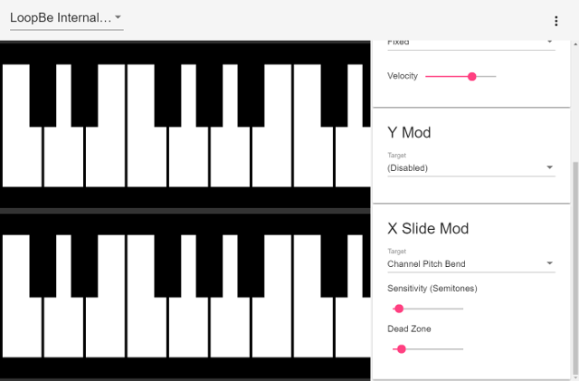

# Midi Keyboard

A touchscreen optimized MIDI keyboard. [Try it out here.](http://elang.us/midi-keyboard/)

# Features:

- Runs in the web browser
- Supports modifiers to control various MIDI params as you play:
    - Channel pitch bend
    - Key pressure
    - Key velocity
- MIDI only. Bring your own synth.

# Browser Support 

A Web MIDI supported browser is required. It has been developed using Chrome.
